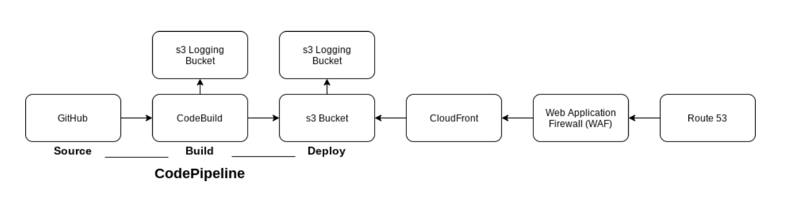

# Foundational Architecture / Architecture fondamentale
{: .no_toc }

## Table of contents / Table des matières
{: .no_toc .text-delta }

1. TOC
{:toc}

---

# Foundational Architecture

We host the geocore application on Amazon Web Services (AWS) utilizing Github as the source for the build files. Once this repository is updated, an Amazon CodePipeline is triggered. It builds the application and deploys it to Amazon s3. It's served to the public through AWS Cloudfront and a Web Application Firewall (WAF) to enhance security. 

If you are building this application yourself, you may be able to use managed services such as AWS Amplify, or other cloud platforms to accomplish a similar strucutre. Please remember that the current application requires Geocore API endpoints, you can use GEO.CA's endpoints found on the geocore documentation, or you can build your own instance.

## Architecture Overview

---

# Architecture fondamentale

Nous hébergeons l'application geocore sur Amazon Web Services (AWS) en utilisant Github comme source pour les fichiers de construction. Une fois ce référentiel mis à jour, un Amazon CodePipeline est déclenché. Il crée l'application et la déploie sur Amazon s3. Il est servi au public via AWS Cloudfront et un pare-feu d'application Web (WAF) pour renforcer la sécurité.

Si vous créez vous-même cette application, vous pourrez peut-être utiliser des services gérés tels qu'AWS Amplify ou d'autres plates-formes cloud pour réaliser une structure similaire. N'oubliez pas que l'application actuelle nécessite des points de terminaison de l'API Geocore, vous pouvez utiliser les points de terminaison de GEO.CA trouvés dans la documentation geocore ou vous pouvez créer votre propre instance.

## Présentation de l'architecture

